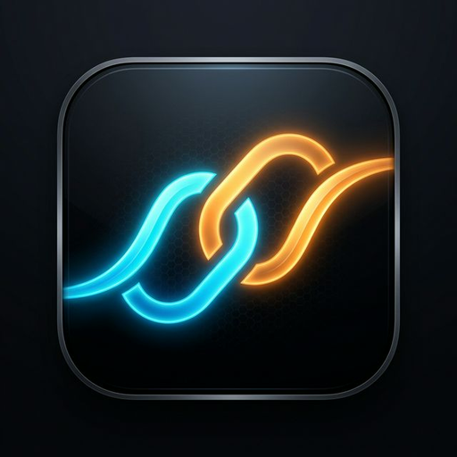

# AirGap Connect

**Control your PC from your phone — over your Wi‑Fi, nothing else.**

AirGap turns any phone or tablet browser into a remote control for your Windows computer: trackpad, keyboard, media, presentations, power, and more — served by a lightweight local Flask receiver. No cloud, no accounts, no internet dependency.

<p align="center">
  
</p>

---

## ✨ Features

### 🖱️ Trackpad
- One-finger move, tap to left-click, two-finger tap to right-click, two-finger drag to scroll
- Adjustable sensitivity (low → high)
- Mouse/pointer fallback for testing from a desktop browser

### ⌨️ Keyboard
- Free-text typing (with an optional fast-paste mode)
- Modifier keys (Ctrl / Alt / Shift / Win) that combine with the next key you tap
- Navigation keys, arrow pad, and one-tap shortcuts (Ctrl+C/V/X/Z/A/S, Alt+Tab, Win)

### 🎵 Media
- Previous / Play-Pause / Next
- System volume slider, synced from the PC on load
- **Now Playing** card — shows the title, artist, and album art of whatever is currently playing (Spotify, browser tab, etc.), pulled from the Windows System Media Transport Controls
- One-tap **Open Spotify**

### 🖥️ Presentation
- Previous / Next slide, Start, End, Black screen, White screen
- Touch-driven laser pointer with a live on-screen dot
- Presentation timer with Start / Stop

### ⏻ Power
- Safe actions: Lock, Sleep, Screen Off, **Wake Screen**
- Destructive actions (Restart, Shutdown, Hibernate, Log Off) — all gated behind a confirmation dialog
- Cancel a pending shutdown

> **Note:** Wake Screen turns the display back on and resets the idle timer — it does **not** type your Windows password or bypass the lock screen. AirGap never stores or transmits credentials.

### 🗂️ More
- **Quick Launch:** Chrome, File Explorer, Terminal, PowerPoint
- **Window Controls:** Minimize, Maximize, Task View, Alt+Tab
- **Running Applications:** live list with PID, one-tap Kill (confirmed)
- **Clipboard:** pull from PC / push to PC
- **Device Info:** hostname, IP, latency, CPU, RAM, battery

### 🔌 Connection & PWA
- Live connection indicator (Connected / Connecting / Offline) with real round-trip latency
- Installable as a Progressive Web App (add to home screen, works offline for the UI shell)
- Fullscreen mode, locked to **portrait** — rotate back if your device tips into landscape
- A branded **AirGap Connect** popup window shows a QR code + the direct URL as soon as the receiver starts, so pairing your phone takes one scan

---

## 🧱 Architecture

```
AirGap_V2/
│
├── Receiver/                      # The Flask app that runs on your PC
│   ├── app.py                     # Routes, UDP discovery broadcast, entry point
│   ├── controllers/
│   │   ├── mouse_controller.py        # Cursor movement, clicks, scroll
│   │   ├── keyboard_controller.py     # Text typing, keys, hotkeys
│   │   ├── media_controller.py        # Playback, volume, now-playing metadata
│   │   ├── presentation_controller.py # Slides, laser pointer, timer
│   │   ├── power_controller.py        # (via system_controller) lock/sleep/shutdown/wake
│   │   ├── apps_controller.py         # Launch/kill apps, window management
│   │   ├── clipboard_controller.py    # Clipboard pull/push
│   │   └── file_controller.py         # File transfer helpers
│   ├── utils/
│   │   ├── logger.py
│   │   ├── network.py                 # LAN IP / hostname detection
│   │   └── qr_generator.py            # QR image + branded pairing popup
│   ├── requirements.txt
│   └── app_build/                     # The static frontend served by Flask
│       ├── index.html
│       ├── style.css
│       ├── app.js
│       ├── sw.js                      # Service worker (offline app shell)
│       ├── register.js
│       ├── manifest.json
│       └── icons / favicon
│
└── easy_start.bat                 # One-click Windows launcher
```

**Frontend:** vanilla HTML/CSS/JavaScript — no build step, no framework. Talks only to the local receiver's REST API.

**Backend:** Flask + Waitress, serving both the API and the static frontend from the same origin on port `5005`. A lightweight UDP broadcast on port `5006` announces the receiver on the LAN for discovery.

---

## 🚀 Getting started

> 📋 Full checklist of everything needed before you start — Python version, OS, network ports, optional apps — see [PREREQUISITES.md](PREREQUISITES.md).


### Requirements
- Windows 10/11 (the automation layer uses Windows-specific APIs)
- Python **3.8–3.13** — see [Compatibility](#-compatibility) below for exactly what's verified where
- Your phone and PC on the **same Wi-Fi network**

### Run it
```bash
git clone https://github.com/miidhunraj/AirGap_V2.git
cd AirGap_V2
easy_start.bat
```

`easy_start.bat` will:
1. Request administrator rights (needed to open the firewall port)
2. Locate a compatible Python install (3.8+), or send you to the official download page if none is found
3. Create an isolated virtual environment in `Receiver\.venv` — your system Python is never touched
4. Install everything in `Receiver/requirements.txt`, retrying automatically on transient network failures
5. Run `verify_install.py` to confirm the install actually works — and auto-attempts one repair (force-reinstall) if it doesn't — before launching anything
6. Add/refresh a Windows Firewall rule for port `5005`
7. Start the receiver and pop up a QR code with the connection URL

Scan the QR code with your phone's camera, or open the printed `http://<your-pc-ip>:5005` URL directly in any mobile browser.

### Manual setup
```bash
cd Receiver
python -m venv .venv
.venv\Scripts\activate
pip install -r requirements.txt
python verify_install.py   # confirms the install is sound before you run app.py
python app.py
```

---

## ✅ Compatibility

AirGap's dependencies were audited directly against PyPI's published wheel
and ABI metadata — not just "it installed on my machine" — so these claims
are specific about what's actually verified versus what's expected to work:

| Python | Core remote control | Now Playing thumbnails |
|---|---|---|
| 3.8 | ✅ all dependencies ship compatible wheels | ✅ |
| 3.9 – 3.12 | ✅ all dependencies ship compatible wheels | ✅ |
| 3.13 | ✅ all dependencies ship compatible wheels | ⚠️ unavailable — see below |

**Why Now Playing is unavailable on 3.13:** it depends on `winsdk`
(Windows Runtime bindings), whose only published release has no Python 3.13
wheel and no practical source-build path for a typical user. `requirements.txt`
marks it with an environment marker (`python_version < "3.13"`) so `pip
install` **skips it automatically** on 3.13 instead of failing your entire
install, and `media_controller.get_now_playing()` degrades gracefully at
runtime — the Media panel just shows "Nothing playing" instead of live
track info. Every other feature is unaffected.

**`psutil==5.9.8`** ships a `cp37-abi3` wheel — the same compiled binary is
loaded unmodified by every CPython 3.7+ interpreter via the stable ABI, so
this one pin is verified across the entire supported range without needing
a per-version build.

Run `python Receiver/verify_install.py` any time to get a live report of
exactly what's available in your environment.


---

## 🔐 Privacy & security

- Everything runs on your local network — no cloud services, no analytics, no external dependencies for core functionality.
- The receiver never stores or transmits your Windows credentials. Features like Wake Screen and Lock only call the equivalent local Windows APIs; nothing simulates typing a password.
- Destructive power actions (Restart, Shutdown, Hibernate, Log Off) always require confirmation in the UI.
- Anyone on your Wi-Fi network who reaches port `5005` can control the PC — treat your Wi-Fi like you would any other trusted local network (e.g. avoid running this on public/shared networks).

---

## 🛠️ Tech stack

| Layer | Tech |
|---|---|
| Frontend | HTML5, CSS3, vanilla JavaScript (PWA) |
| Backend | Flask, Waitress |
| Automation | pyautogui, pynput, keyboard, mouse, pycaw, pygetwindow, comtypes |
| Media metadata | winsdk (Windows Runtime bindings) |
| Media/QR | Pillow, qrcode |
| System info | psutil |

---

## 🗺️ Roadmap / ideas

- More quick-launch app slots
- Multi-monitor aware screenshot/mirroring
- Custom keyboard shortcut profiles

Contributions and issues are welcome — see the [repo](https://github.com/miidhunraj/AirGap_V2) to get started.

---

## ☕ Support

If AirGap saves you a walk across the room, consider buying me a coffee:

**[buymeacoffee.com/miidhunraj](https://www.buymeacoffee.com/miidhunraj)**
**[instagram.com/miidhunee](https://instagram.com/miidhunee)**
